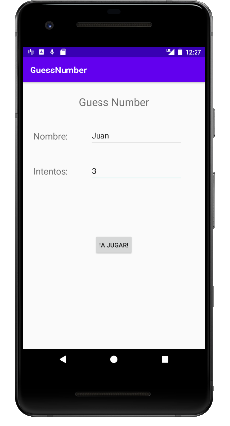
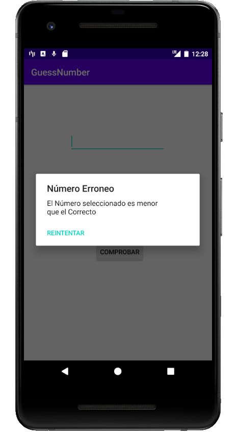
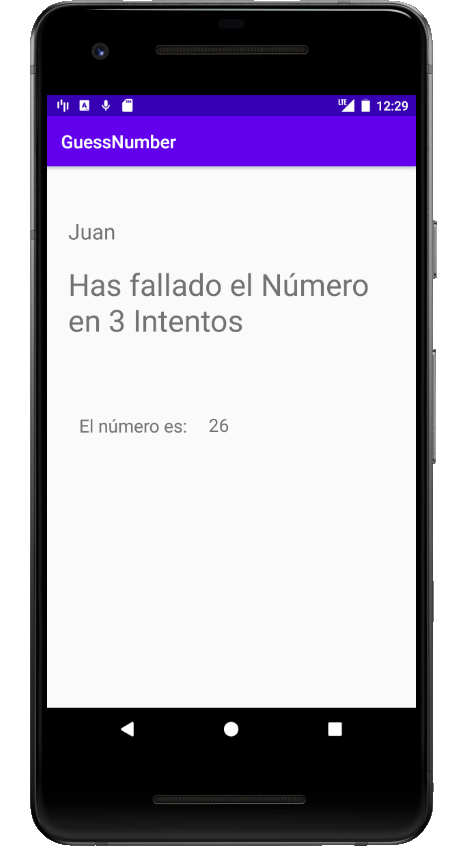

# GuessNumber
En este Proyecto hemos realizado una aplicación que al iniciarla nos pedirá el nombre de usuario, y el número de intentos a través de un `EditText`, al pulsar el `Button`, nos pasara a la siguiente `Activity` que nos generara un número aleatorio que el usuario deberá acertar introduciendo el número que cree que es en un `EditText`, nos irán saliendo los intentos restantes en la parte de abajo del `EditText` al pulsar sobre el `Button` comprobara si el número introducido es mayor, menor o igual que el introducido que se le irá informando al usuario con un `AlertDialog` si es mayor o menor.

Si ha acertado el número le pasara a otra `Activity` que nos indica en cuantos intentos lo hemos hecho, nos indica si hemos acertado y además aparece el número generado a acertar.
Sin embargo si hemos fallado en los intentos en la `Activity` saldrán los intentos, nos indica que ha fallado y además aparece el número generado a acertar.

# Cosas a tener en cuenta
* En este Proyecto hemos incluido el POJO `Jugador` que contiene el nombre de usuario, Intentos, Intentos Realizados, un Booleano de si ha acertado y el número Generado.
* Nuestro POJO `Jugador` es compartido por todas las `Activity`, ya que lo iniciamos en una clase que hemos creado que hereda de `Application`.
* Para hacer que funcione bien la nueva clase que hereda de `Application` hay que cambiar el `manifiest` el `android:name` de `Application`.
* Nuestro `Jugador` es declarado en la `Activity` ConfigActivity y es rellenado al principio con el nombre de usuario y los intentos. En la siguiente `Activity` se le añadirá los intentos realizados, el número generado y un true o false depende si ha acertado o no.
* Ya en EndPlayActivity accedemos al objeto `Jugador` compartido y ponemos en un `TextView` si ha acertado y en cuantos intentos. En diferentes `TextView` vamos poniendo el nombre de usuario y el número a acertar todo ello incluido en el POJO `Jugador`.
# Clases Utilizadas
* Jugador
* GuessNumberApplication

# Activity Utilizadas
* ConfigActivity
* PlayActivity
* EndPlayActivity

# Imagenes De La Aplicación

